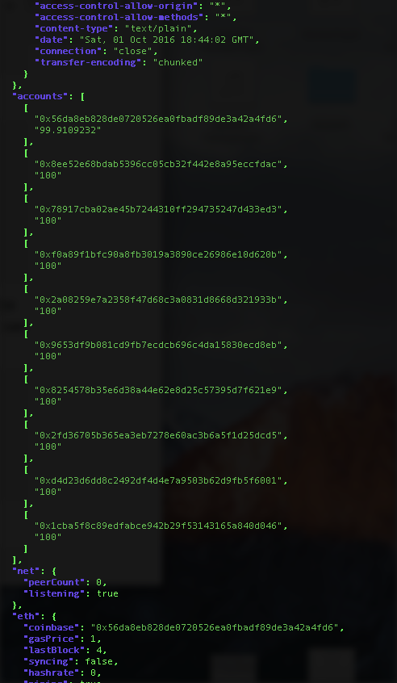

# rpc-check

Checks for JSON RPC endpoints of ethereum nodes and displays basic statistics and gives a gist how accessible it is.

Reason for this tool to exist: There is like 10 mistakes a lot fo people make with their RPC nodes and most of them are revealed by this cli tool.

[](https://badge.fury.io/js/rpc-check) [](https://travis-ci.org/sebs/rpc-check)

This tool checks:

* host http headers accounts accessible to web3
* mining and peer count status
* account funds
* gas price

[](./doc/rpc-check.png)

* [License](./LICENSE)
* [Changelog](./CHANGELOG.md)

## Usage

```
rpc-check http://localhost:8545            
version EthereumJS TestRPC/v2.2.7/ethereum-js
network 1475011275094
mining true
accounts 10
gasPrice 1
```

Only JSON output

```
rpc-check http://localhost:8545 --json
{
  "version": "EthereumJS TestRPC/v2.2.7/ethereum-js",
  "network": "1475011275094",
  "mining": true,
  "accounts": 10,
  "gasPrice": 1
}
```


## Install

```
npm install rpc-check -g
```
